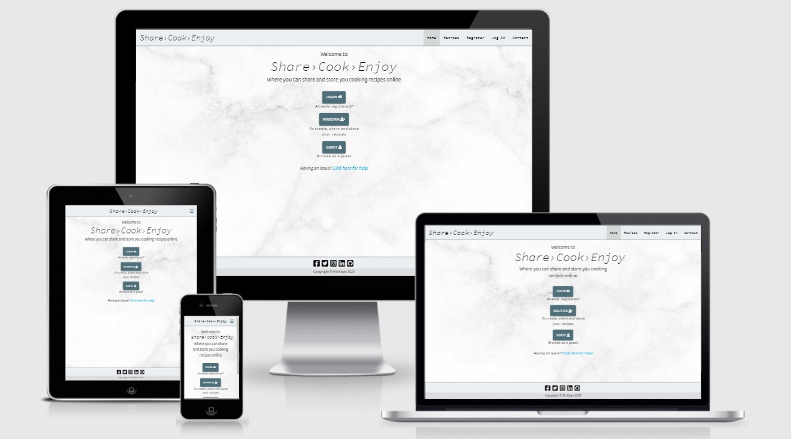

# Ifti Khan Milestone Project 3 - Data Centric Development Project

[Click Here To Visit My Deployed Project Site](https://iftikhan-milestone-3-project.herokuapp.com/)



## Project Title - Share, Cook, Enjoy Online Cookbook

### Introduction
This repository is showcasing my third milestone project for The Code Institute.
 
Share, Cook, Enjoy is a simple way for online user to view, create, share and store their favourite recipes. 
For this data centric development project I am going to create a web application that allows users to create, read, update and delete (CRUD) recipes stored within a database. 

The reason I have chosen to pursue this as my third milestone project is that it will allow me to showcase the new skills that 
I have learnt from The Code Institute and previous skill learnt from other projects. The primary skills being showcased here is 
going be Python and its libraries, as well as the Materialize Framework instead of the Bootstrap Framework.  

# UX – User Experience

## The Who? 
The project will be aimed at users who want to share their cooking recipes with other cooking enthusiast who are looking for new and exciting recipe ideas to cook. 

## The What?
The project will connect users from different backgrounds, cultures and countries and allow them to share their cooking recipes through this 
online web application and a place where they can digitally store them.  

## The How?
I will be using a variety of different technologies to create this project, with the first and for most being the Python programming language. 
I will also be utilising the Materialize Framework and the MongoDB database program to store user information and cooking recipes. 

The web application will allow non registered users to view other users shared recipes, but will not have full access, 
but will be given the option to register to get full access. Registered users will have full access and once logged in to the web application and they 
can create their own recipes and share them with others, as well as update and delete their created recipes. Registered users will also be allowed to 
update their username and password. An Admin will also be created to manage the application and oversee any user issues.

# User Stories
My users for this project are people seeking new cooking recipes for their breakfast, lunch, dinners and more. It is also aimed at users who are willing to share their cooking recipes with others, but it also a way for them to store their cooking recipes online, so they can be accessed via a laptop, tablet or even a smartphone anywhere in the world. 

* As a user, I want to be able to register to the website, so that I can login and have full access to the web application.

* As a user, I want to be able to login, so that I can create my own recipes.

* As a user, I want to be able to logout of my account from any page. 

* As a user, I want to be able to visit my account/profile page, so that I can change my username, password and delete account.

* As a user, I want a detailed add recipe form, so that I can fill in the form with great detail for the next user to follow. 

* As a user, I want to be able to view all recipe ingredients and cooking steps, so that I can follow the instructions on how to cook that food dish.

* As a user, I want to able to search for recipes, so that I can find a specific recipe within the website.

* As a user, I want to able to view my recipes only, so that I can see how many recipes I have created.

* As a user, I want to be able to edit my recipes, so that I can fix mistakes or update them. 

* As a user, I want to be able to delete my recipes which i have created.

* As a user, I want to be able to contact the website administrator, so that if have any question or issues they can be addressed. 

# Design 
## Framework
The Materialize framework has been chosen for the project, the reason for this is that for the last two projects I have used the Bootstrap framework. 
So for this project I would like to utilize the Materialize framework and gain some exposure to it.

## Colour Scheme
The colour scheme that I have chosen will be easy on the eyes and easy for users to read the cooking recipes. 
The buttons and flash messages will stand out from the rest of the content so they can be noticed. All colour chosen will 
be validated beforehand using the WebAIM online contrast checker to make sure they meet accessibility standards. 

| Colour used from Materialize |
|------------------------------|
| #eceff1 blue-grey lighten-5  |
| #cfd8dc blue-grey lighten-4  |
| #546e7a blue-grey darken-1   |
|                              |

## Typography 
For this project I have chosen two fonts from Google Fonts, the first font I have chosen is 
called [Source Code Pro](https://fonts.google.com/specimen/Source+Code+Pro?preview.text_type=custom). 
This font will used in my navigation bar, headings, flash messages and button. 

The second font I have chosen is also from Google Fonts and it is called [Baloo 2]( https://fonts.google.com/specimen/Baloo+2?preview.text_type=custom). 
This font will be used the main content of the project as well as displaying the main recipe cooking instructions. 

## Imagery
The images that will be used for this project will will be taken from Google or any other cooking website, and will be referenced in my media section of the write up.  The icons used within this project will be utilised 
from the [Font Awesome CDN]( https://cdnjs.com/libraries/font-awesome). 

# Wireframes

### Home Page -> [View PDF](/writeup_files/wireframes/home-page-all-devices.pdf)
### Registration Page -> [View PDF](/writeup_files/wireframes/registration-page-all-devices.pdf)
### Login Page -> [View PDF](/writeup_files/wireframes/login-page-all-devices.pdf)
### Contact Page -> [View PDF](/writeup_files/wireframes/contact-page-all-devices.pdf)
### Account Page -> [View PDF](/writeup_files/wireframes/account-page-all-devices.pdf)
### All Recipe Page -> [View PDF](/writeup_files/wireframes/all-recipes-page-all-devices.pdf)
### Add Recipe Page -> [View PDF](/writeup_files/wireframes/add-recipe-page-all-devices.pdf)
### Update Recipes Page -> [View PDF](/writeup_files/wireframes/update-recipe-page-all-devices.pdf)
### Admin Page -> [View PDF](/writeup_files/wireframes/admin-page-all-devices.pdf)

# Features
Here is a list of features that will be implemented and utilized within my project. 
There will also be a list for future features that I would like to add to the project 
and will revisit at a later date to implement. 

## Existing Features 

### Different navigation bars for different users
* A non-registered will only be able to see the following navigation links: Home, Recipes, Register, Login and Contact

* For a registered they will have full access and will be able to see the following navigation links: Home, Recipes, Account, Logout and Contact

### Registration form
* This feature will only be available to non-registered and will be located in the top navigation bar for non-registered. The user will also be prompted on the homepage and all recipes page to register to get full access to create, share and store recipes.  

### Login form
* This feature will be available to non-logged in users allowing them to login into the web application from the homepage or the navigation bar. Once the user is logged in, the login navigation link will disappear and the logout navigation link will appear.   

### Contact form
* A contact form feature will be created for users to get in contact with the site admin to help with any issues e.g. login issues, forgotten username and passwords. 

### User account page
* This page will allow user to change their username and password or even delete their account. It will also allow the users to add recipes from page, as well as displaying their created recipes.

### Add recipe form
* This feature will provide a detailed recipe form for users to create their recipes to store and share. 

### Edit/Update recipe
* This feature will allow the user to edit thier own created recipes using an edit input form and will be found in the view recipe page.

### Delete recipe
* This feature will allow users to delete their own created recipes, and will be found in the view recipe page.

### Search recipes
* This feature will allow users on the all recipe page to search for a recipe using any keyword or words they choose. 

### Recipe default image/URL
* This feature will be found in the add and edit recipe forms, it will allow users to add an image URL from google or another website. If an image URL is not provided and default image placeholder will be shown for that recipe.

### Social links in footer
* This feature will be available for all users and will contain social media icon links like 
Facebook, Twitter, Instagram, GitHub, and LinkedIn within the footer of the web application. 

### Error pages 
* A 404 Error html page will be created, a 404 error indicates that the resource requested cannot be found.

* A 500 Error html page will be created, a 500 error indicates that the server has encountered 
an issue and cannot perform the request made by the user. 

## Future Features To Implement

### Allowing users to upload images
* This feature is to allow users to upload their own images of their own recipes that they have personally taken.  

### Users can save their favourite recipes 
* This feature will allow users to save recipes they come across whilts browsing through the all recipe section and will save to their user account profile page under a favourite recipe section.

### Email verification when users register 
* This feature will work alongside the registration form, so when a user inputs an email address, this feature would then send a verification email to make sure the email address provided is valid and active.

### Forgotten password 
* This feature will allow users to reset their own password if they forget it, instead of a user getting in contact with the admin of the web application. 

## Technologies Used
Here is a list of programming languages that I used to create this project along with a list of database storage, software, frameworks, libraries and tools I also used to create this project.

### Programming Languages

* HTML5 -> [Visit Site](https://en.wikipedia.org/wiki/HTML5)
    * HTML5 was used to create the overall structure and page elements to be viewed in a web browser.

* CSS3 -> [Visit Site](https://en.wikipedia.org/wiki/CSS)
    * CSS3 was used to give my project and its content style, layout, colours, a different font and format.

* JavaScript -> [Visit Site](https://en.wikipedia.org/wiki/JavaScript)
    * JavaScript was used to give my project an interactive look and feel and to be used to interact with APIs.

* Python -> [Visit Site](https://www.python.org/downloads/)
    * Python was used to create the backend server side logic of the web application.

### Database, Frameworks, Libraries, Software & Tools Used

* MongoDB -> [Visit Site](https://www.mongodb.com/)
    * MongoDB will be used to store all user and recipe information and this will be done by utilising MongoDB key and value setup, to then be called using python. 

* MongoDB Compass v1.26.1 -> [Visit Site](https://www.mongodb.com/try/download/compass)
    * MongoDB Compass is GUI software, that allows users to create, read, update and delete there MongoDB clusters, collections, documents and so much more locally from their computer. 

* Materialize CSS & JS -> [Visit Site](https://cdnjs.com/libraries/materialize)
    * The Materialize CSS and JS will be used for the responsive side of my project. It will also be used for visual elements, validation, affect and initialising some materialize interactive elements.

* Font Awesome v5.15.1 CDN -> [Visit Site](https://cdnjs.com/libraries/font-awesome)
    * The Font Awesome CDN will be used for the icons that i use within my project to help give the project good visual elements and a good user experience.

* JQuery v3.6.0 -> [Visit Site](https://cdnjs.com/libraries/jquery)
    * JQuery will be used to manipulate the Document Object Model (DOM), create animations and events.

* Email JS -> [Visit Site](https://www.emailjs.com/docs/sdk/installation/)
    * This will be used for the contact modal, so that a user can send an actual email to me via an input forms provided.

* Google Fonts -> [Visit Site](https://fonts.google.com/)
    * Google fonts has been used to import the font i have chosen directly from google into my main CSS file.

* GitHub -> [Visit Site](https://github.com/)
    * I used GitHub to store my project files by creating a repository for it and then using the Git terminal and its commands to version control and store my files.

* Heroku -> [Visit Site](https://www.heroku.com/)
    * I used Heroku to deploy my web application because GitHub can only deploy static websites where as Heroku can deploy websites with backend server side capabilities. So GitHub this time is only being used for storage but linked to my Heroku, so when I push to my GitHub it automatically deploys to my Heroku. See deployment section for more info. 

* Gitpod -> [Visit Site](https://www.gitpod.io/)
    * I used this online development environment because of its integration within GitHub. With a click of a button within any repo or browser extension, Gitpod will open up and I am ready to code without installing any physical programs on my laptop.  

* Visual Studio Code -> [Visit Site](https://code.visualstudio.com/)
    * I used this code editor as well but this was mainly used as a backup, because of Gitpods 50 hour usage limit per month. I chose VSCode because Gitpod utilises VSCode so I was familiar with it. Another reason is because of it built in Git functions, which allowed me to clone my repositories easily and pull, commit and push to my repositories.    

* Balsamiq Desktop -> [Visit Site](https://balsamiq.com/wireframes/desktop/)
    * Balsamiq was used in the design stage where I created my wireframes for my project to help me get visual representation of what my project could look like.

* Paint 3D -> [Visit Site](https://www.microsoft.com/en-gb/p/paint-3d/9nblggh5fv99?activetab=pivot:overviewtab)
    * Paint 3D was used to crop screenshot images and then saved to an appropriate image format.

* Google Chrome & Chrome Dev Tools -> [Visit Site](https://support.google.com/chrome/answer/95346?co=GENIE.Platform%3DDesktop&hl=en)
    * Google Chrome and Chrome Dev Tools was used to help create my project as well as testing it using the developer tools.

* Markdown Table Generator -> [Visit Site](https://www.tablesgenerator.com/markdown_tables)
    * This online tool helped me to create the markdown tables for testing section of my readme file.

* Online Random Keygen -> [Visit](https://randomkeygen.com/)
    * This online tool was used to help generate a secure key for my secret key variable within my project.

* Python Tutor -> [Visit Site](http://pythontutor.com/)
    * I used this online tool to help me be better understand my python code because it allowed me to see my code visually run step by step. 

# Validation
In this section I have used a few different validation tools to thoroughly check and make sure my project code is fully compliant and accessible. If there is any non-compliant code or warnings within the project I will document it and then fix it and this will be the first step of my testing and debugging.

HTML5 Validation -> [Visit Site](https://validator.w3.org/)

CSS3 Validation -> [Visit Site](https://jigsaw.w3.org/css-validator/)

WebAIM Contrast Checker -> [Visit Site](https://webaim.org/resources/contrastchecker/)

JavaScript Validation -> [Visit Site](https://esprima.org/demo/validate.html)

Python Validation -> [Visit Site](http://pep8online.com/)

### Validation Document -> [Visit Document](/writeup_files/validation/validation.md)

# Testing
When it comes to testing and debugging I find it easier and good practise to test as I go along with my project and this can be seen in my git commit messages to my repository every time I pushed my completed files.

In this section I will test my project against my user stories and further text by doing some manual testing. These test will be done using a variety of different browsers and a variety of different screen sizes as well to ensure my projects compatibly and responsiveness.

# UX - User Story Testing
Here in this section I will provide a user story scenario with screenshot examples with steps if necessary to test my project against my user story.

### UX User Story Testing Document -> [Visit Document](/writeup_files/testing/user_story_testing.md)

# Further Testing
I have decided to further test my project by testing all of the features implemented as seen in my user story testing and more. I will test my project in a variety of different browser to ensure it is fully compatible. The browsers I have chosen are Google Chrome, Microsoft Edge, Firefox and Opera. Another crucial test is to make sure that the project is fully responsive on a wide range of device sizes. 

### Further Testing Document -> [Visit Document](/writeup_files/testing/further_testing.md)

Throughout the whole project I developed my project on my Dell Inspiron 15inch Laptop and my Acer 24inch Monitor. I also used Chrome Dev tools whilst programming my project and used the responsive tool to simulate different device sizes. I also did some physical testing on a few devices such as my Samsung Galaxy S21+, Samsung Galaxy Tab 6.

# Known Issues And Solutions
During my testing I found a few minor bugs that were fixed very easily. 

One bug that I found was in the base.html in the contact modal section dropdown list validation. Since materialize do not validate dropdown lists and The Code Institute in the MongoDB Mini Project allowed us to user their JavaScript code to validate dropdown lists. Since I added the class validate to the dropdown list attribute there was a conflict, so to fix the issue I remove the class validate.

Another bug that I encountered during test was within the account.html and it was to do with the recipe cards position for the created recipes by that specific user. I had on larger screens set the div col class to xl3, but this caused and issue with the fifth recipe cards position. So to fix this bug all I had to do was change the div col class from xl3 to xl2. 

A known issue that I have is with located within my add_recipe.html and edit_recipe.html ingredient and cooking instruction list. The issue is when a user is adding the ingredient to the text area or cooking instruction text area, they cannot leave an intentional blank line to separate the text. The reason for this is within the view_recipe.html I will think that the blank line is an ingredient or instruction because I have in the HTML displayed the ingredient list as a list element and the cooking instructions as an order list element.

To overcome the issue within the add and edit recipe html files in the label of the two text area I have told the users when entering the information to add each ingredient or instruction on a new line and not to leave any blank lines. 

# Deployment
In this section I will list the steps I took to deploy my project to Heroku. 

## Step 1 – MongoDB
1.1	– The first thing I did was sign up to MongoDB and create an account.

1.2	– The next step was to create a cluster.

1.3	– Once the cluster was created I then created my Database and gave it a unique name.

1.4	– After the Database was created, I then created my collections (tables) within the database. 

1.5	– Once I created my collections, I then added some data to my collections. 

| Recipes Collection |                            |
|--------------------|----------------------------|
| id                 | OjectId                    |
| recipe_name        | Test Recipe                |
| recipe_description | This is a test description |
|                                                 |

1.6	– Once all of this was done I then had the key information I needed and that is the MongoDB Name and the MongoDB URI.

## Step 2 – GitHub & Gitpod
2.1 – After signing up to MongoDB and getting the key information, I then created my GitHub repository for my project and gave it an appropriate name. 

2.2 – After creating my repository, I then launched it in Gitpod.

2.3 – Once Gitpod was done building the workspace, I then started to create the appropriate files, directories and sub directories for the project.

2.3.1 - Once I create the Procfile, I then entered this line of code ```web: python app.py``` on a single line with no space at the end or an empty line underneath. This is needed for Heroku to start running the app.py file.   

2.4 – Once all the files and directories where in place I then installed the appropriate library and frameworks for my project. 

| Files in Root Directory | Other Directories | Sub Directories and Files | Libraries/Frameworks |
|------------------|-------------|-------------------------|----------------------|
| app.py           | static      | static/css/style.css    | click==7.1.2         |
| env.py           |             | static/js/script.js     | dnspython==2.1.0     |
| Procfile         | templates   | /base.html              | Flask==1.1.2         |
| README.md        |             | /index.html             | Flask-PyMongo==2.3.0 |
| requirements.txt |             |                         | itsdangerous==1.1.0  |
|                  |             |                         | pymongo=3.11.3       |
|                  |             |                         | Werkzeug==1.0.1      |
|                                                                                 |

2.5 – Once this was done I then created a requirements file using the CLI interface using the following command: ```pip3 freeze –local > requirements.txt```

2.6 – Then I created an env file to store the key configuration information for my project and a Procfile, these are needed for the next step.

2.7 – Just before I committed my project to GitHub, I added the env file to .gitignore because it contains key and sensitive information and set the debug within the app.py file to False. 

2.8 – Once this was done, I then committed my files to my GitHub repository and I was ready for the next step.

## Step 3 - Heroku
3.1 – The first thing I did was sign up to Heroku and create an account. 

3.2 – The next step is to create a new app by clicking new and selecting create new app in the top right hand corner.

3.3 – Give the app a unique app name and select a region that I closet to you, once this is done click create app. 

3.4 – Once this is done you will be taken to the app dashboard and from here you need to click on the settings tab for the next step.

3.5 – On this page I added the config vars for my app and they are:

| Config Vars  | Key Information   |
|--------------|-------------------|
| IP           | 0.0.0.0           |
| PORT         | 5000              |
| SECRET_KEY   | *secretkey*       |
| MONGO_URI    | *mongouriaddress* |
| MONGO_DBNAME | *databasename*    |
|                                  |

3.6 – After adding the config vars, I then click on the deploy tab for the next step.

3.7 – When I was on the deploy page, I went down to the deployment section and clicked on the “Connect to GitHub” button, which then allowed me to search for my project repository within my GitHub. 

3.8 – Once I had found it I then clicked on the connect button, this then allowed me to choose a branch to deploy from my GitHub, once this was chosen I then clicked on the “Enable Automatic Deploys” button. 

3.9 – The next step was to press the “Deploy Branch” button to full deploy my project to Heroku. Heroku will then set everything up and once done a “View” button will appear.

3.10 – The final step is to click the “View” button and you will be taken your web application which is fully deployed to Heroku.  

# Local Clone
To make a local clone you are going to need a few tool/software installed and setup a few things. 

## Tools/Software 
* An IDE like Gitpod or a Local Text Editor software like VSCode.
* A MongoDB account for the database collections.
* The latest version of Python installed on your Local Machine if you are planning on using a Local Text Editor.

## Local Clone Steps
1.	Open up your IDE or Local Text Editor, for demo purposes I am using VSCode. 

2.	You need to make a clone of my repo and for this you need the repo address which can be found on my GitHub under the “Code” button or the URL address below.

My repo URL - https://github.com/ifti-khan/ifti-khan-milestone-project-3.git

3.	Once you have the address, go to your VSCode and press the F1 key and type in clone, then you will see “Git: Clone”, click on that and then you will be prompted to enter the GitHub URL address located above. 

4.	Copy and paste my repo URL and then press enter, you will then be prompted to find a save location for the repo.

5.	Once you have a save location and have saved the repo and small popup will appear in the bottom right prompting you to open the project. 

6.	Once you open the project, on the left you will see under the files tabs, my repo files and directories. 
7.	The next thing that need to be done is to create an env.py file in the root directory.
8.	Inside of the env.py file, you will need to add the following code:

```
# Python env Code

import os

os.environ.setdefault("IP", "0.0.0.0")
os.environ.setdefault("PORT", "5000")
os.environ.setdefault("SECRET_KEY", "yourkeyhere")
os.environ.setdefault("MONGO_URI", "yourmongouriaddress")
os.environ.setdefault("MONGO_DBNAME", "yourdatabasename")
```
9.	After creating the env file, you will need to install all of the project requirements from the requirments.txt file. This can easily be done using the terminal window within VSCode.
10.	 In the terminal type the following command:
```pip3 install –r requirements.txt```
In my VSCode I do not need to type the sudo command, so if the top command does not work then type the following command:
```sudo pip3 install –r requirements.txt```
11.	The next step is to create a database with a unique name in MongoDB but don’t forget to get the MongoDB URI and Database name. 

12.	Once that is done you will need to create the following five collections within the database. 

## MongoDB Database Structure

This collection stores all of the users information. 
| Users Collection |               |          |
|------------------|---------------|----------|
| _id              | ObjectId      | ObjectId |
| fullname         | Fullname      | String   |
| email            | Email Address | String   |
| username         | Username      | String   |
| password         | Password      | String   |
|                                             |

This collection stores all of the recipe information.
| Recipes Collection  |                      |          |
|---------------------|----------------------|----------|
| _id                 | ObjectId             | ObjectId |
| recipe_name         | Recipe Name          | String   |
| recipe_description  | Recipe Description   | String   |
| recipe_image_url    | Image URL or Blank   | String   |
| recipe_meal_type    | A Meal Type          | String   |
| recipe_cuisine_type | A Cuisine Type       | String   |
| recipe_diet_type    | A Diet Type          | String   |
| recipe_cooktime     | Recipe Cooking Time  | String   |
| recipe_servings     | Servings             | String   |
| recipe_ingredients  | Ingredient List      | Array    |
| recipe_steps        | Cooking Instructions | Array    |
| created_by          | Username             | String   |
|                                                       |

This collection stores all of the meal types for the meal types dropdown for the add and edit recipe forms dropdown list.
| Meals Collection |                |          |
|------------------|----------------|----------|
| _id              | ObjectId       | ObjectId |
| meal_name        | Meal Type Name | String   |
|                                              |

This collection stores all of the cuisine types for the cuisines types dropdown for the add and edit recipe forms dropdown list.
| Cuisines Collection |                   |          |
|---------------------|-------------------|----------|
| _id                 | ObjectId          | ObjectId |
| cuisine_name        | Cuisine Type Name | String   |
|                                                    |

This collection stores all of the diet types for the diet types dropdown for the add and edit recipe forms dropdown list.
| Diets Collection |                |          |
|------------------|----------------|----------|
| _id              | ObjectId       | ObjectId |
| diet_name        | Diet Type Name | String   |
|                                              |

13. Another thing that needs to be done is within the app.py file and this is to scroll all the way to the bottom and turn debug from False to True. 

14.	Once all the above is done, you can know successfully run the web application using the following command in the terminal: ```python3 app.py```

# Credits
Here in this section I have listed the various different types of content and code I used within my project. The majority of code and content has come from The Code Institutes MongoDB Mini Project that I had done before my Milestone 3 Project. I also want to reference the help I got from The Code Institutes lessons, challenges and video tutorials.

## Content
I would like to reference that all of the recipe information and recipe images have come from the BBC good food webiste and all information is being used for education purposes.

[BBC Good Food Website](https://www.bbcgoodfood.com/)

## Media
[Font Awesome Icon](https://fontawesome.com/) - These have been used throughout the entire project and can be seen in the website forms and buttons. 

[Marble Body Background](https://sensientpharma.com/wp-content/uploads/2019/03/marble.jpg) - This image has been used for the body background in all HTML pages. 

[Recipe card images](https://www.bbcgoodfood.com/)

## Code
Here I have listed all of the external URLs that helped me during the development of my project.

### External URL Document -> [Visit Document](writeup_files/documents/ext_url_document.md)

## Acknowledgements
I want to acknowledge my student mentor Adegbenga Adeye for his helpful advice and guidance throughout the whole project. I would also like to thank The Code Institute for the course lessons, challenges, video tutorials they supplied and the MongoDB Mini Project. 

Lastly I would like to thank Stack Overflow, W3C School, Materialize, jQuery, the slack community and the other URL links that helped me develop my project.

The reason I chose to base my project on a cookbook is that I wanted to challenge myself and becuase it was one of the recommended project idea. The Overall development of this project was a challenge throughout but who doesn't like a challenge. 

I learnt a lot from developing this project and learnt just how powerful and useful Python, Flask, MongoDB and Materialize can be.