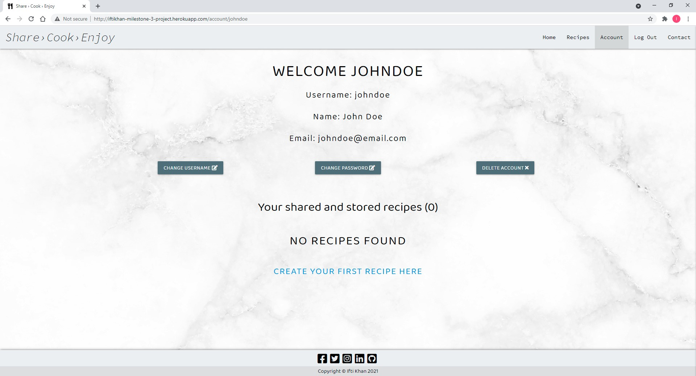

# User Story Testing
Here I will test my web application against my user stories,

## User Registration
* As a user, I want to be able to register to the website, so that I can login and have full access to the web application.

### Step 1
Visit website and click on the register button located in the navigation bar, or the main body of the page. 

### Step 2
Now fill in the registration form with valid details and then click the register button located at the bottom when done.

### Step 3
Once the register button is clicked, the user will be taken to there account page and a message will display to the user saying registration success.

## User Login
* As a user, I want to be able to login, so that I can create my own recipes.

### Step 1
Visit website and click on the login button located in the navigation bar, or the main body of the page. 

### Step 2
Now fill in the login form with valid details and then click the login button located at the bottom when done.

### Step 3
Once the login button is clicked, the user will be taken to there account page and a message will display to the user a welcome message and from here the user can add, view, edit and delete recipes.

## User Logout
* As a user, I want to be able to logout of my account from any page.

### Step 1
For a user to logout of the website all they have to do is click the logout button, located in the top navigation bar of any page. 

### Step 2
Once a user clicks the logout button they will be taken to the homepage of the website and a message will display to the user saying they have been logged out. 

## User Account Page
* As a user, I want to be able to visit my account/profile page, so that I can change my username, password and delete account.

### Change Username
### Step 1
For a user to change there username, they need to be logged in and on the account page and from there they need to click on the change username button. 

### Step 2
Once the button is clicked, the user will be taken to the change username form. At the top of the form the current username field will be filled in and disabled. Now all the user has to do is type in a new unique username and click on the change button. 

### Step 3
Once the change button has been clicked, the user will be logged out and taken to the homepage where a message will display to the user saying username has been changed and for them to login in to the website with the new username. 

### Step 4
Once the user now logs in with the new username, it will welcome them with the new username and display it to them. 

### Change Password
### Step 1
For a user to change their password they have to be logged in and on the account page and from there they need to click the change password button.

### Step 2
Once the button is clicked, the user will be taken to the change passoword form. From here the user has to enter their current account password first, then they have to enter their new password and the last step is to confirm their new password and press the change button at the bottom. 

### Step 3
Once the change button is clicked the user will be taken to the account page where a message will inform the user that the password has been changed. 

### Delete Account
### Step 1
For a user to delete their account they have to be logged in and on the account page and from there they need to click the delete account button.

### Step 2
Once the button is clicked, a delete confirmation modal will appear with important info inside informing the user about the action they are going through with. To delete the account all the user has to do is press the delete button. 

### Step 3
Once the delete button is clicked it will log the user out and take them to the homepage and inform them with a message saying that their account has been deleted along with their recipes. 

## User Add Recipe Form
* As a user, I want a detailed add recipe form, so that I can fill in the form with great detail for the next user to follow. 

### Step 1
For a user to add a recipe, the user needs to be logged in and on the account page. For a new user they have to click on the create your first recipe link. But for a user who already has recipes created, they will need to click on the add recipe button located in the account page body.  

### Step 2
One the user has clicked the button they will be taken to the create recipe form page.

### Step 3
On this page the user can fill in the form with as much detail as they want and once they are done all they have to do is click the create button.

### Step 4
Once the user has clicked the create button, it will take them to the all recipes page and display a message to them saying their recipe has been created.  

## User View Recipe Form
* As a user, I want to be able to view all recipe ingredients and cooking steps, so that I can follow the instructions on how to cook that food dish. 

### Step 1
For a user to view a recipe in detail, they need to be registered and logged into the website. Once they are they can view either from their account page or from the all recipe page. To view all they have to do is click on the recipe card or the view button.

### Step 2
Once the user has clicked on either the recipe card or view button, they will be taken to the view recipe page of that recipe. 

### Step 3
Once the user is on the view recipe page, they can see all of the recipe attributes, ingredients list and cooking instruction list. To fully view the ingredients and cooking instruction all the user has to do is click on the collapsable element in the body of the page and it will display all the recipe details to them. 

## User Search Recipe
* As a user, I want to able to search for recipes, so that I can find a specific recipe within the website.

### Step 1
For a user to search a recipe, they need to be registered and logged into the website. From here the user needs to go to the all recipe page and type in a search query and click search

### Step 2
Once the user clicks search button it will display the search results below the search bar.

## User My Created Recipes
* As a user, I want to able to view my recipes only, so that I can see how many recipes I have created.

### Step 1
For a user to view their created recipes all they have to do is log into the website. Once logged in they can find their created recipes on the account page towards the bottom of the page.

## User Edit Recipes
* As a user, I want to be able to edit my recipes, so that I can fix mistakes or update them. 

### Step 1
For a user to edit their created recipes all they have to do is log into the website. Once logged in they can edit a recipe in three ways, the first way is from their account page by clicking the edit button within the recipe card. The second way to edit is to navigate to the all recipes page and click on the edit button located within the recipe cards. The third way to edit is to view a recipe in detail, where the edit button can be found under the cooking instruction list. 

### Step 2
Once the edit button is clicked, they will be taken to the edit recipe form and from there the user can make the necessary changes to the recipe and once done they need to click on the update button.

### Step 3
Once the user has clicked on the update button, the user will be taken to the all recipe page and a message will display to the user saying to them that the recipe has been updated.

## User Delete Recipes
* As a user, I want to be able to delete my recipes which i have created.

### Step 1
For a user to delete their created recipes all they have to do is log into the website. Once logged in the user needs to view the recipe that they want to delete.

### Step 2
Once the user is on the view recipe page of a specfic recipe that they have created, they then need to click on the delete button located near the bottom of the page. Once the button is clicked a delete confirmation modal will appear, with some important info inside the body of the modal for the user to read. For a user to delete the recipe all they have to do now is click the delete button.

### Step 3
Once the delete button is clicked, they user will be taken their account page and a message will display to the user informing them that the recipe has been deleted

## User Contact Admin Form
* As a user, I want to be able to contact the website administrator, so that if have any question or issues they can be addressed.

### Step 1
For a user to contact the website admin, they can either be logged in or not. But if a user is logged in all of their user infromation like their fullname, username and email will auto fill within the contact form. For a non logged in user they would have to fill in the contact form details manually. 

### Step 2
Once the contact form is filled in, all the user has to do now is click the send button. Once the send button is clicked, the user will be prompted with a message box informing the user that the message has been sent. 

### Step 3
This is how the message looks once the admin receives it on their end.
