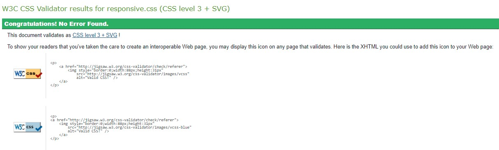
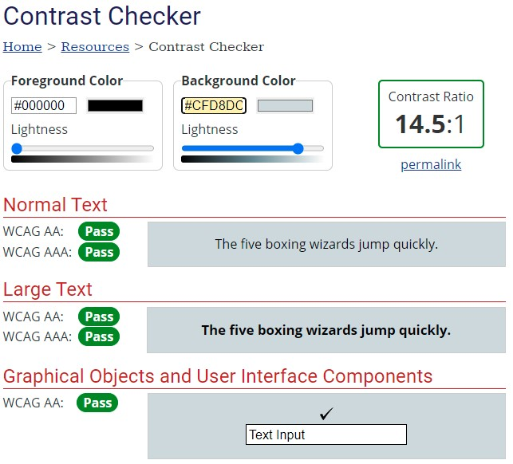

# Validation

## HTML5 Validation
Here I have tested all of the HTML files using the HTML5 W3C validator and got some interesting results. The validator does not seem to recognize Jinja2 templating language and it showing a large number of errors. 

After going through the errors i did mange to pick up a few HTML error, nothing critical just small mistakes. One mistakes was that I closed a form of incorrectly in my base file. Another was that I used pattern attributes on textarea and number input field.

## CSS
Here I have tested all of the CSS files using the CSS3 W3C validator and got no errors on both of my CSS files. 

### style.css

### responsive.css

## Contrast Checker
Here I have tested all of the main colours that I used within my project, out of the three main colour two where given an all pass rating. But one was given a fail in one area, after doing a little reading below this colour was not going to be used for that purpose.

### Colour 1 - 5/5

### Colour 2 - 5/5

### Colour 3 - 4/5

## JavaScript
Here I have tested my javascript files using an online syntax validator. After checking both of my js files with the syntax checker, both results showed that I had no errors.

### script.js

### sendemail.js

## Python
Here i have tested my python app file using an online validator to make sure that the python code is PEP8 compliant. After checking my code I got one error and that was because I had the import math in the wrong area. After making the change and putting at the top, I checked the code again and no errors.

### app.py
